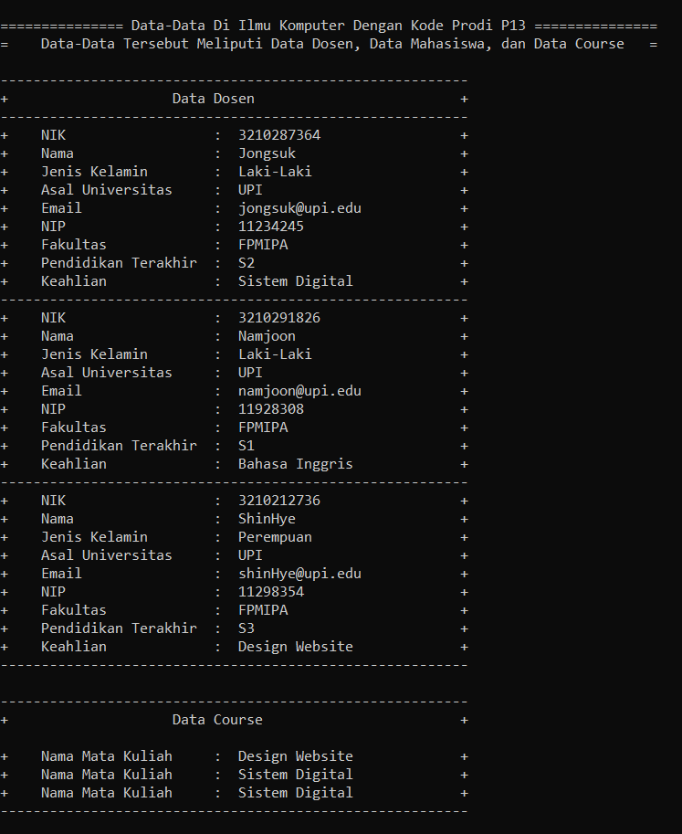
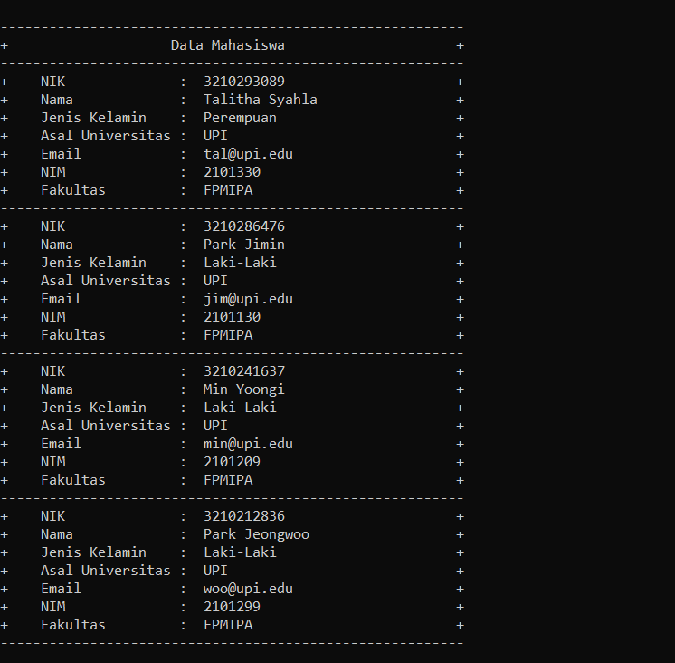

## Janji
Saya Talitha Syahla NIM 2101330 mengerjakan
Soal Latihan 4 dalam mata kuliah Desain Pemrograman Berorientasi Objek untuk keberkahanNya maka saya tidak melakukan 
kecurangan seperti yang telah dispesifikasikan. Aamiin.

# TUGAS LATIHAN 2 DPBO 2023
Buatlah program berbasis OOP menggunakan bahasa pemrograman C++ dan Python  yang mengimplementasikan konsep inheritance, composition, dan array of object pada kelas-kelas tersebut:

    Mahasiswa: NIM, nama, jenis_kelamin, fakultas
    Human: NIK, nama, jenis_kelamin
    SivitasAkademik: asal_universitas, email_edu
    Dosen: NIP, nama, jenis_kelamin, fakultas, pend_terakhir, keahlian
    Course: nama_matakuliah, 
    Program Studi: nama_prodi, kode, course

File README ini berisikan design program, penjelasan alur program, dan dokumentasi saat program dirun/dijalankan.

# Design Program
Design pada program disini menggunakan 6 Class, yaitu:

1) Class Human, Class ini menjadi Super/Base Class yang memiliki atribut:
    - NIK berupa `string`
    - Nama berupa `string`
    - Gender berupa `string`

Class Human ini menjadi Parent Class untuk Class SivitasAkademik. Hal ini dikarenakan semua atribut yang ada pada SivitasAkademik termasuk ke dalam Human, karena SivitasAkademik merupakan turunan atau subclass dari Human. Misalnya, anggota SivitasAkademik seperti Dosen dan Mahasiswa memiliki atribut yang umum dengan Human. Maka dari itu Human menjadi parent class yang dapat diwarisi oleh SivitasAkademik.

2) Class SivitasAkademik, Class ini memiliki atribut:
    - Asal_Universitas berupa `string`
    - Email berupa `string`
Class ini menjadi Child Class dari Class Human. Hal ini dikarenakan SivitasAkademik merupakan sekelompok manusia/human yang memiliki kegiatan di akademik. Class SivitasAkademik ini juga merupakan Parent Class untuk Class Mahasiswa dan class Dosen. 

3) Class Mahasiswa, Class ini memiliki atribut:
    - NIM berupa `string`
    - Fakultas berupa `string`

Class Mahasiswa ini mewarisi Class SivitasAkademik yang berarti Class ini menjadi Child Class dari Class SivitasAkademik. Hal ini dikarenakan SivitasAkademik merupakan kelompok manusia/human yang memiliki kegiatan di akademik, dan Mahasiswa adalah anggota dari kelompok tersebut.

4) Class Dosen, Class ini memiliki atribut:
    - NIP berupa `string`
    - Fakultas berupa `string`
    - Pend_terakhir berupa `string`
    - Keahlian berupa `string`

Class Dosen ini mewarisi Class SivitasAkademik yang berarti Class ini menjadi Child Class dari Class SivitasAkademik. Hal ini dikarenakan SivitasAkademik merupakan kelompok manusia/human yang memiliki kegiatan di akademik, dan Dosen adalah anggota dari kelompok tersebut.

5) Class ProgramStudi, Class ini memiliki atribut:
    - nama_prodi berupa `string`
    - Kode berupa `string`
    - dosen berbentuk list
    - mahasiswa berbentuk list
    - course berbentuk list

5) Class Course, Class ini memiliki atribut:
    - nama_matakuliah berupa `string`

Keenam Class di atas memiliki setter dan getternya masing-masing.

UML Program

# Alur Program
Pada program ini, inputannya dilakukan secara hardcode jadi user tidak perlu memasukkan inputan. 

# Dokumentasi
### Python

